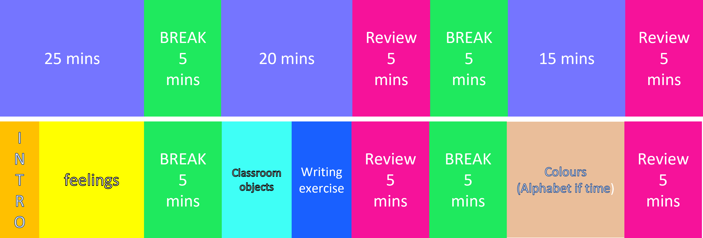
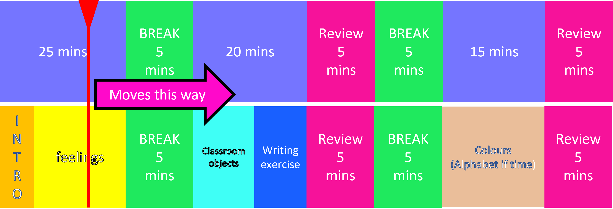

# Live Timeline

A live timeline I build in response to this reddit thread: [Looking for 'live timeline' software. Anyone heard of something that can do this?](https://www.reddit.com/r/software/comments/rr1dsy/looking_for_live_timeline_software_anyone_heard/)

The website can be found here: [carpenterx.github.io/live-timeline/](https://carpenterx.github.io/Live-Timeline/)

## From reddit:

### Looking for 'live timeline' software. Anyone heard of something that can do this?

I teach 1 hour and 20 minute online classes to grade 1 students.

To help manage my time, I imagined some software which would allow me to input a timeline, and it would have a line that runs across it over the course of an hour and 20 minutes. Either that, or it would scroll the timeline. I would press 'play' at the beginning of the class and it would help show where I need to be.

Timeline example: [https://imgur.com/aOx2iSJ](https://imgur.com/aOx2iSJ)

Software mock up: [https://imgur.com/CHzpwbj](https://imgur.com/CHzpwbj)

Do you know software like this?
